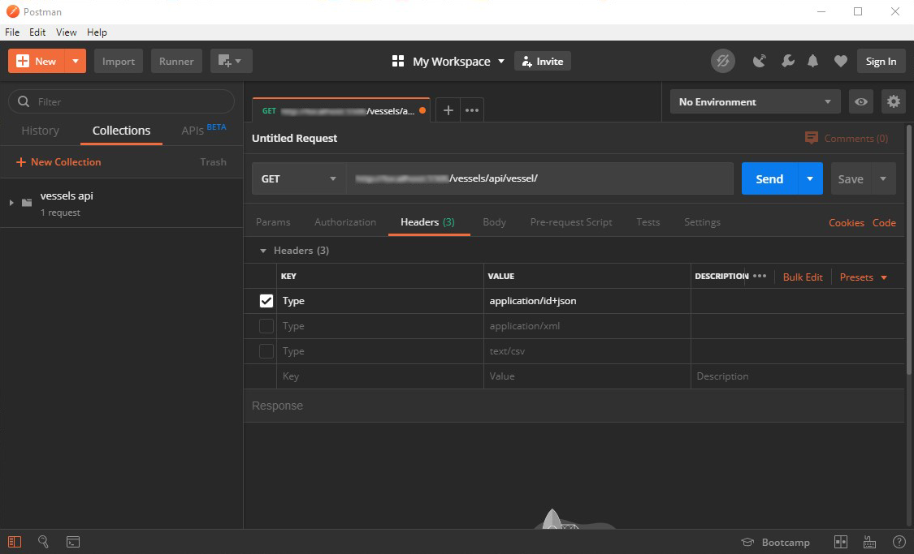

# Vessels Tracks API

This is a **RESTful API** that serves vessel tracks from a raw vessel positions data-source.

*Before using the API the "vessel_positions.sql" SQL Dump must be first imported in the database. The dump was created using MariaDB v10.3.11*

*This API was constructed without any prior knowledge of PHP.

It supports the following filters:
* **MMSI** - Single or Multiple, separated by a comma (../api/vessel?mmsis=xxxxxxxxx, yyyyyyyyy)
* **Longitude** - Min and/or Max (../api/vessel?minLon=a&&maxLon=b)
* **Latitude** - Min and/or Max (../api/vessel?minLat=a&&maxLat=b)
* **Time Interval** - Start Datetime and/or End Datetime, it can also be used without the time parameter (../api/vessel?startDatetime=YYYY-MM-DD HH:MM:SS&endDatetime=YYYY-MM-DD HH:MM:SS)

It supports the following content types:
* application/json (This is the default type)
* application/ld+json
* application/xml
* text/csv

*To use you have to set the "Type" parameter in the header of the request*

#

Your task is to create a **RESTful API** that serves vessel tracks from a raw vessel positions data-source.
The raw data is supplied as a JSON file that you must import to a database schema of your choice.

Fields supplied are:
* **mmsi**: unique vessel identifier
* **status**: AIS vessel status
* **station**: receiving station ID
* **speed**: speed in knots x 10 (i.e. 10,1 knots is 101)
* **lon**: longitude
* **lat**: latitude
* **course**: vessel's course over ground
* **heading**: vessel's true heading
* **rot**: vessel's rate of turn
* **timestamp**: position timestamp

**The API end-point must:**
* Support the following filters: 
  * **mmsi** (single or multiple)
  * **latitude** and **longitude range** (eg: minLat=1&maxLat=2&minLon=3&maxLon=4)
  * as well as **time interval**.
* Log incoming requests to a datastore of  your choice (plain text, database, third party service etc.)
* Limit requests per user to **10/hour**. (Use the request remote IP as a user identifier)
* Support the following content types:
  * At least two of the following: application/json, application/vnd.api+json, application/ld+json, application/hal+json
  * application/xml
  * text/csv

**Share your work:**
* Stage your solution on a demo page or
* Fork this repo and create a pull request that contains your implementation in a new branch named after you.

**Have fun!**
